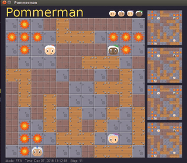

## Pommerwarrior

RL Agent developed as a course project for AI class. Current performance: the learnt disco agent beats the baseline SimpleAgent with a win ratio of 35%.

## Instructions to Run

1. Install OpenAI Gym from pip.
2. Follow [installation instructions for Pommerman](https://github.com/MultiAgentLearning/playground/tree/master/docs)
3. Run `src/Runner.py`

Step 3 launches 3 of our trained agents against the baseline agent. You may vary this composition by changing the runner script.

## Some Winning Plays

Red Agent (Top left) is our best performing Agent
Green Agent (Top right) is the baseline Agent 
The other two are our suboptimal Agents

